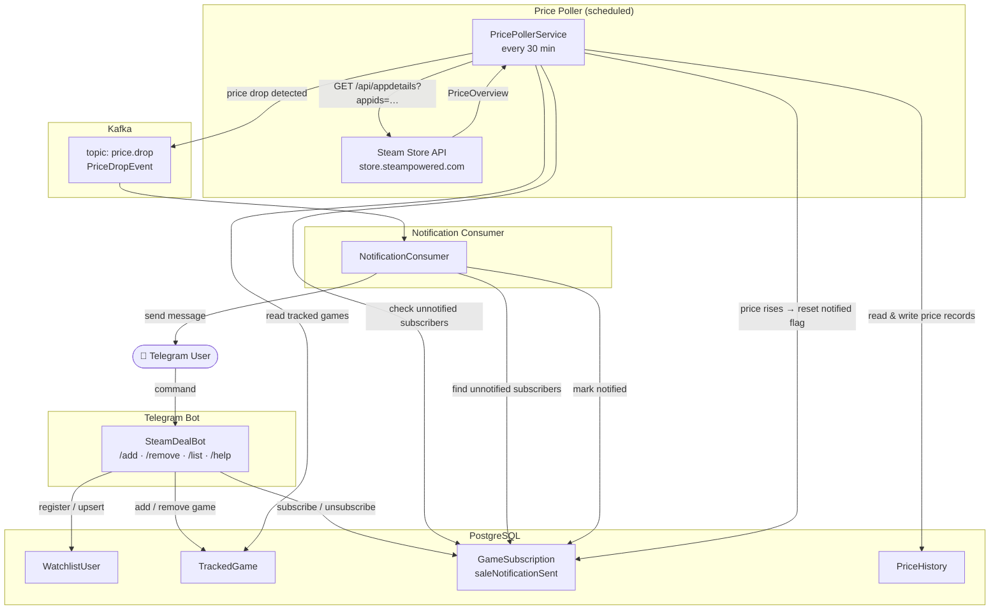

# Game Deal Watcher

A Spring Boot application that tracks Steam game prices and sends Telegram notifications when prices drop.

Users manage their watchlist through a Telegram bot. A background scheduler polls the Steam store API at a configurable interval, detects price changes, and publishes events to Kafka. A Kafka consumer picks up each event and delivers the notification to every subscribed user via Telegram.

## How it works



## Notification lifecycle

1. User adds a game with `/add <appId>` — a `GameSubscription` row is created with `saleNotificationSent = false`.
2. The poller records the first price as a baseline (no event is sent).
3. On subsequent polls, if the price drops and the user has not yet been notified, a `PriceDropEvent` is published to Kafka.
4. The consumer delivers the notification; on success it flips `saleNotificationSent = true`.
5. When the price returns to its original level the flag is reset to `false`, making the user eligible for the next sale notification.

## Telegram commands

| Command | Description |
|---|---|
| `/start` or `/help` | Show help message |
| `/add <appId> [name]` | Add a game to your watchlist |
| `/remove <appId>` | Remove a game from your watchlist |
| `/list` | Show your current watchlist |

The `appId` is the number in a Steam store URL:
`store.steampowered.com/app/`**`1245620`**`/` → `1245620`

## REST API

| Method | Path | Description |
|---|---|---|
| `GET` | `/watchlist/history/{appId}` | Price history for a game |

## Tech stack

| Layer | Technology |
|---|---|
| Language | Java 21 |
| Framework | Spring Boot 4.1.0 |
| Messaging | Apache Kafka |
| Database | PostgreSQL (Spring Data JPA) |
| Telegram | TelegramBots 9.3.0 (long polling) |
| Build | Maven |

## Running locally

### Prerequisites

- Docker Desktop
- JDK 21+
- A Telegram bot token ([@BotFather](https://t.me/BotFather))

### 1. Start infrastructure

```bash
docker compose up -d
```

This starts PostgreSQL on port `5432`, Kafka on port `9092`, and Kafka UI on port `8081`.

### 2. Set environment variables

Create an IntelliJ run configuration (or export in your shell) with:

```
TELEGRAM_BOT_TOKEN=<your token>
TELEGRAM_ALLOWED_CHAT_ID=<your chat id>
POSTGRES_URL=jdbc:postgresql://localhost:5432/steam_notifier
POSTGRES_USER=steam
POSTGRES_PWD=steam
KAFKA_BOOTSTRAP_SERVER=localhost:9092
```

> **Tip:** Get your chat ID by messaging [@userinfobot](https://t.me/userinfobot) on Telegram.

### 3. Run the app

```bash
./mvnw spring-boot:run
```

Or run `GameDealWatcherApplication` directly from IntelliJ.

### 4. Kafka UI

Open [http://localhost:8081](http://localhost:8081) to inspect topics, consumer groups, and messages.
